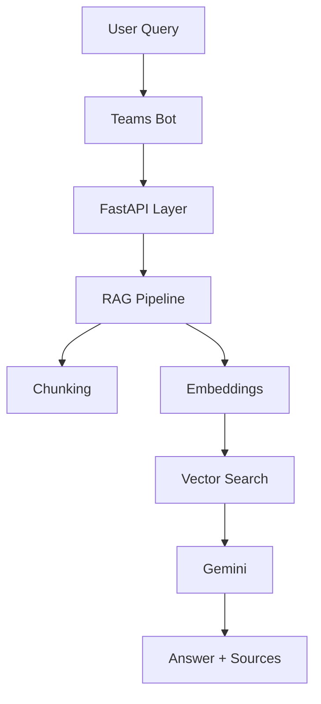

<!-- 💀 FINAL BOSS GITHUB PROFILE README -->

<p align="center">
  
</p>

<p align="center">
  
</p>

---

## 🧠 Who Am I

```yaml
name: Tushar Pandey
role: AI Engineer / Backend Architect
mission: Build scalable AI systems that solve real problems
stack: FastAPI | Supabase | Gemini | RAG
```

---

## 🚀 Flagship Build

### 🤖 AI Teams Bot (Production RAG System)

<p align="center">
  
</p>



### ⚡ Capabilities

* Understands **imperfect human queries**
* Works with **real enterprise documents**
* Returns **context-aware answers + references**
* Designed for **low latency + scalability**

---

## ⚔️ Tech Arsenal

<p align="center">
  
</p>

<p align="center">
  
  
  
</p>

---

## 📊 GitHub Matrix

<p align="center">
  
  
</p>

<p align="center">
  
</p>

---

## 🐍 Contribution Snake

<p align="center">
  
</p>

---

## 🧠 Current Grind

* ⚡ High-performance RAG pipelines
* 🧩 Hybrid search + reranking
* 🏗️ AI system architecture
* 🚀 Production deployments

---

## 🌐 Connect

<p align="center">
  <a href="#"></a>
  <a href="#"></a>
</p>

---

## 👁️ Visitors

<p align="center">
  
</p>

---

## ⚡ Philosophy

> "Build systems that work in production, not just in presentations."

---

<p align="center">
  
</p>

🔥 Engineered for impact
