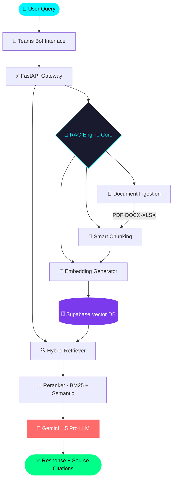

<p align="center">
  
</p>

<p align="center">
  
</p>

<p align="center">
  
  
  
</p>

---


## 🧠 Identity Stack

```yaml
┌──────────────────────────────────────────────┐
│  name       :  Tushar Pandey                 │
│  role       :  AI Engineer & Backend Arch    │
│  location   :  India 🇮🇳                      │
│  available  :  Freelance + Full-time         │
├──────────────────────────────────────────────┤
│  core       :  RAG Pipelines                 │
│               LLM Orchestration              │
│               Backend Architecture           │
│               System Design @ Scale          │
├──────────────────────────────────────────────┤
│  stack      :  Python · FastAPI · Supabase   │
│               Gemini · Postgres · Docker     │
│               LangChain · ChromaDB           │
├──────────────────────────────────────────────┤
│  philosophy :  "If it's not scalable,        │
│                it's not finished."           │
└──────────────────────────────────────────────┘
```

<br clear="right"/>

---

## 🚀 Featured Project — AI Teams Bot

> **Production RAG system deployed in a real enterprise environment.**

<p align="center">
  
</p>

### 🏗️ System Architecture



### ⚡ What Makes It Production-Ready

| Feature | Status | Detail |
|---|---|---|
| 🧠 Vague query handling | ✅ | Query expansion + intent parsing |
| 📄 Multi-format ingestion | ✅ | PDF, DOCX, XLSX, TXT, HTML |
| 🔗 Source citations | ✅ | Every answer traces back to docs |
| ⚡ Hybrid retrieval | ✅ | BM25 + Semantic + Reranker |
| 🛡️ Error resilience | ✅ | Fallback chains, graceful degradation |
| 🚀 Scalable infra | ✅ | Docker + async FastAPI + Supabase |
| 📊 Observability | ✅ | Logging, latency tracking, eval metrics |

```python
# Core RAG pipeline — simplified
async def query_pipeline(user_query: str) -> RAGResponse:
    expanded     = await query_expander.run(user_query)
    candidates   = await hybrid_retriever.fetch(expanded, top_k=20)
    reranked     = await reranker.score(candidates, query=user_query)
    context      = build_context(reranked[:5])
    answer       = await gemini.generate(context, user_query)
    return RAGResponse(answer=answer, sources=reranked[:5])
```

<p align="center">
  <a href="https://github.com/tusharpandey436/YOUR-REPO">
    
  </a>
  <a href="https://your-demo-link">
    
  </a>
</p>

---

## ⚔️ Tech Arsenal

<p align="center">
  
</p>
<p align="center">
  
</p>

<br/>

<p align="center">
  
  
  
  
  
  
</p>

---

## 📊 GitHub Intelligence

<p align="center">
  
  
</p>

<p align="center">
  
</p>

<p align="center">
  
</p>

---

## 🐍 Contribution Snake

<p align="center">
  <picture>
    <source media="(prefers-color-scheme: dark)" srcset="https://raw.githubusercontent.com/tusharpandey436/tusharpandey436/output/github-contribution-grid-snake-dark.svg" />
    <source media="(prefers-color-scheme: light)" srcset="https://raw.githubusercontent.com/tusharpandey436/tusharpandey436/output/github-contribution-grid-snake.svg" />
    
  </picture>
</p>

---

## 🎯 Current Focus — 2025 Roadmap

```
╔══════════════════════════════════════════════════════════════════╗
║  Q1 2025   ██████████░░░░  75%   Hybrid RAG + Reranking         ║
║  Q2 2025   ████████░░░░░░  60%   Agentic Systems (Tool Use)     ║
║  Q3 2025   ████░░░░░░░░░░  30%   Multi-Modal RAG (Vision)       ║
║  Q4 2025   ██░░░░░░░░░░░░  15%   On-Device / Edge LLM Deploy    ║
╚══════════════════════════════════════════════════════════════════╝
```

- 🔬 **Experimenting with** — ColBERT, SPLADE, late interaction models
- 🏗️ **Building** — Modular RAG framework (plug-and-play retrievers)
- 📚 **Studying** — Mixture of Experts, speculative decoding
- 🚢 **Deploying** — Production eval pipelines (RAGAS + custom metrics)

---

## 🏆 Achievement Unlocked

<p align="center">
  
</p>

---

## 🌐 Connect With Me

<p align="center">
  <a href="https://www.linkedin.com/in/YOUR-LINK">
    
  </a>
  <a href="mailto:tusharpandey436@gmail.com">
    
  </a>
  <a href="https://your-portfolio.dev">
    
  </a>
  <a href="https://twitter.com/YOUR-HANDLE">
    
  </a>
</p>

---

<p align="center">
  
  
</p>

<p align="center">
  <i>"Production systems aren't built in tutorials. They're forged in debugging sessions at 2am."</i>
</p>

<p align="center">
  
</p>
