<div align="center">

<!-- HEADER BANNER -->


<!-- LIVE TYPING -->


<br/>

<!-- STATUS BADGES -->


</div>

---


---

##  The Engineer Behind the Terminal


```typescript
// tushar.config.ts — Last updated: 2025

const TUSHAR_PANDEY = {
  role        : "AI Engineer & Backend Architect",
  location    : "India 🇮🇳",
  available   : ["Freelance", "Full-time", "Contract"],

  expertise   : {
    primary   : ["RAG Pipelines", "LLM Orchestration"],
    secondary : ["System Design", "Backend Architecture"],
    emerging  : ["Agentic AI", "Multi-Modal RAG", "Edge LLM"],
  },

  stack: {
    ai        : ["LangChain", "Gemini", "OpenAI", "HuggingFace"],
    backend   : ["FastAPI", "Python", "Node.js", "Async IO"],
    data      : ["Supabase", "PostgreSQL", "pgvector", "Redis"],
    infra     : ["Docker", "GCP", "Nginx", "GitHub Actions"],
    search    : ["BM25", "Semantic Search", "Hybrid Retrieval"],
  },

  philosophy  : "If it's not scalable, it's not finished.",
  currentGoal : "Build the most robust open-source RAG framework 🚀",
} as const;
```

<br clear="right"/>

---


---

##  Project Showcase

> Click any card to open the repo. Stars and forks update live from GitHub.

---

### 🏆 Flagship Project

<div align="center">

[](https://github.com/tusharpandey436/YOUR-RAG-REPO)

</div>

<div align="center">


</div>

<br/>

> 💡 **Problem**: Enterprise teams drowning in documents — policies, manuals, SOPs, reports. Nobody reads them. Nobody finds answers fast enough.
>
> **Solution**: A Teams-integrated AI bot that answers questions instantly, with source citations, across all document formats.

### 🗺️ System Architecture

```mermaid
flowchart LR
    subgraph INPUT ["📥 Input Layer"]
        U(["👤 User\nQuery"])
        D(["📄 Documents\nPDF·DOCX·XLSX·TXT"])
    end

    subgraph GATEWAY ["⚡ API Gateway"]
        TB["🤖 Teams Bot\nConnector"]
        FG["🚀 FastAPI\nAsync Gateway"]
        AUTH["🛡️ Auth &\nRate Limiter"]
    end

    subgraph INGESTION ["📦 Ingestion Pipeline"]
        PARSE["📋 Document\nParser"]
        CHUNK["🔪 Smart\nChunker"]
        META["🏷️ Metadata\nExtractor"]
        EMB["🧬 Embedding\nGenerator"]
    end

    subgraph STORAGE ["🗄️ Storage Layer"]
        VDB[("🟣 Supabase\npgvector")]
        CACHE[("⚡ Redis\nCache")]
        META_DB[("📊 Postgres\nMetadata")]
    end

    subgraph RETRIEVAL ["🔍 Retrieval Engine"]
        BM["📝 BM25\nKeyword Search"]
        SEM["🧠 Semantic\nVector Search"]
        HYB["🔀 Hybrid\nFusion (RRF)"]
        RANK["📊 Cross-Encoder\nReranker"]
    end

    subgraph GENERATION ["💎 Generation Layer"]
        CTX["📐 Context\nBuilder"]
        LLM["✨ Gemini\n1.5 Pro"]
        EVAL["📈 RAGAS\nEvaluator"]
    end

    subgraph OUTPUT ["📤 Output Layer"]
        RES(["✅ Answer +\nSource Citations"])
        LOG["📊 Observability\n& Logging"]
    end

    U --> TB --> FG --> AUTH
    D --> PARSE --> CHUNK --> META --> EMB --> VDB
    AUTH --> BM & SEM
    VDB --> SEM
    BM & SEM --> HYB --> RANK
    RANK --> CTX --> LLM --> EVAL
    LLM --> RES
    EVAL --> LOG
    CACHE -.-> FG
    META_DB -.-> META

    classDef primary fill:#00f7ff,color:#000,stroke:none,font-weight:bold
    classDef success fill:#00ff88,color:#000,stroke:none
    classDef accent fill:#8b5cf6,color:#fff,stroke:none
    classDef warning fill:#f59e0b,color:#000,stroke:none
    classDef danger fill:#ff6b6b,color:#fff,stroke:none
    classDef neutral fill:#1a1a2e,color:#00f7ff,stroke:#00f7ff,stroke-width:1px

    class U,D primary
    class RES success
    class VDB accent
    class LLM warning
    class RANK danger
    class FG,HYB,CTX neutral
```



### 🧬 Core Pipeline — Production Code

<details>
<summary><b>📂 Click to expand full pipeline implementation</b></summary>

```python
# rag_engine/pipeline.py
from dataclasses import dataclass
import asyncio, time

@dataclass
class RAGResponse:
    answer      : str
    sources     : list[Document]
    confidence  : float
    latency_ms  : int
    eval_scores : dict[str, float]

class ProductionRAGPipeline:
    def __init__(self, config: PipelineConfig):
        self.retriever   = HybridRetriever(config)
        self.reranker    = CrossEncoderReranker()
        self.generator   = GeminiGenerator(config)
        self.evaluator   = RAGASEvaluator()
        self.cache       = RedisSemanticCache()

    async def run(self, query: str) -> RAGResponse:
        start    = time.perf_counter()
        expanded = await self._expand_query(query)
        if cached := await self.cache.get(expanded):
            return cached
        bm25_results, sem_results = await asyncio.gather(
            self.retriever.bm25_search(expanded, top_k=30),
            self.retriever.semantic_search(expanded, top_k=30),
        )
        fused    = reciprocal_rank_fusion(bm25_results, sem_results)
        reranked = await self.reranker.score(fused[:20], query)
        context  = self._build_context(reranked[:5], max_tokens=3000)
        answer   = await self.generator.complete(SYSTEM_PROMPT, context, query)
        scores   = await self.evaluator.score(query, context, answer)
        response = RAGResponse(
            answer      = answer,
            sources     = reranked[:5],
            confidence  = scores["faithfulness"],
            latency_ms  = int((time.perf_counter() - start) * 1000),
            eval_scores = scores,
        )
        await self.cache.set(expanded, response)
        return response
```

</details>

### 📊 Production Metrics

| Metric | Target | Achieved | Status |
|--------|--------|----------|--------|
| **Answer Faithfulness** | > 85% | **91.4%** | 🟢 Exceeds |
| **Context Relevance** | > 80% | **87.2%** | 🟢 Exceeds |
| **P95 Latency** | < 3s | **1.8s** | 🟢 Exceeds |
| **Multi-format Support** | 5 types | **7 types** | 🟢 Exceeds |
| **Cache Hit Rate** | > 30% | **43%** | 🟢 Exceeds |
| **Concurrent Users** | 50 | **200+** | 🟢 Exceeds |

<div align="center">
  <a href="https://github.com/tusharpandey436/YOUR-RAG-REPO">
    
  </a>
  &nbsp;
  <a href="https://your-demo-link">
    
  </a>
  &nbsp;
  <a href="https://your-docs-link">
    
  </a>
</div>

---

### 🗂️ All Projects — Live Repo Cards

<div align="center">

<!-- ROW 1 — AI / RAG Projects -->
<a href="https://github.com/tusharpandey436/YOUR-REPO-1">
  
</a>
<a href="https://github.com/tusharpandey436/YOUR-REPO-2">
  
</a>

<!-- ROW 2 — Backend / API Projects -->
<a href="https://github.com/tusharpandey436/YOUR-REPO-3">
  
</a>
<a href="https://github.com/tusharpandey436/YOUR-REPO-4">
  
</a>

<!-- ROW 3 — Tools / Utilities -->
<a href="https://github.com/tusharpandey436/YOUR-REPO-5">
  
</a>
<a href="https://github.com/tusharpandey436/YOUR-REPO-6">
  
</a>

</div>

---

### 📌 Project Categories at a Glance

```
🤖 AI / RAG Systems
   ├── AI Teams Bot ────────── Production RAG · Gemini · Supabase · Hybrid Retrieval
   ├── YOUR-REPO-1 ─────────── [short description]
   └── YOUR-REPO-2 ─────────── [short description]

⚙️ Backend / APIs
   ├── YOUR-REPO-3 ─────────── [short description]
   └── YOUR-REPO-4 ─────────── [short description]

🛠️ Tools / Utilities
   ├── YOUR-REPO-5 ─────────── [short description]
   └── YOUR-REPO-6 ─────────── [short description]
```

---


---

## ⚔️ Full Tech Arsenal

<div align="center">

### 🤖 AI / ML Stack


### ⚙️ Backend & Infrastructure


### 🛠️ Dev Tools


</div>

---

## 🧭 Skill Radar — Self Assessment

```
                        ★★★★★ EXPERT
                              │
  System Design  ────────── ████████████████░░  90%
  RAG Pipelines  ────────── ████████████████░░  88%
  FastAPI/Async  ────────── ███████████████░░░  85%
  LLM Integration────────── ███████████████░░░  85%
  Vector Search  ────────── ██████████████░░░░  80%
  Prompt Eng.    ────────── █████████████░░░░░  75%
  DevOps/Infra   ────────── ████████████░░░░░░  70%
  Agentic AI     ────────── ██████████░░░░░░░░  60%  ← Active Learning
  Multi-Modal    ────────── ████████░░░░░░░░░░  45%  ← Exploring
                              │
                        ★☆☆☆☆ LEARNING
```

---


---

## 📊 GitHub Intelligence Dashboard

<div align="center">


<br/>


<br/>


</div>

---

## 🏆 Achievements & Trophies

<div align="center">

</div>

---

## 🐍 Commit Serpentine

<div align="center">
  <picture>
    <source media="(prefers-color-scheme: dark)" srcset="https://raw.githubusercontent.com/tusharpandey436/tusharpandey436/output/github-contribution-grid-snake-dark.svg" />
    <source media="(prefers-color-scheme: light)" srcset="https://raw.githubusercontent.com/tusharpandey436/tusharpandey436/output/github-contribution-grid-snake.svg" />
    
  </picture>
</div>

---


---

## 🗓️ 2025 Engineering Roadmap

```
┌─────────────────────────────────────────────────────────────────────────┐
│                       TUSHAR'S 2025 BUILD PLAN                          │
├──────────┬──────────────────────────────────┬───────────┬───────────────┤
│ QUARTER  │ FOCUS                            │ PROGRESS  │ STATUS        │
├──────────┼──────────────────────────────────┼───────────┼───────────────┤
│  Q1 2025 │ Hybrid RAG + Reranking           │ ████████░ │ 🟢 Complete   │
│  Q1 2025 │ RAGAS Evaluation Integration     │ ███████░░ │ 🟢 Complete   │
│  Q2 2025 │ Agentic AI (Tool-Use + Planning) │ █████░░░░ │ 🟡 In Progress│
│  Q2 2025 │ Modular RAG Framework (OSS)      │ ████░░░░░ │ 🟡 In Progress│
│  Q3 2025 │ Multi-Modal RAG (Vision + Docs)  │ ██░░░░░░░ │ 🔵 Planned    │
│  Q3 2025 │ Streaming + SSE Response APIs    │ ██░░░░░░░ │ 🔵 Planned    │
│  Q4 2025 │ On-Device / Edge LLM Deployment  │ █░░░░░░░░ │ 🔵 Planned    │
│  Q4 2025 │ Open Source RAG Benchmark Suite  │ ░░░░░░░░░ │ 🔵 Planned    │
└──────────┴──────────────────────────────────┴───────────┴───────────────┘
```

---

## 🧠 What I'm Reading / Learning

<details>
<summary><b>📚 Current Study Stack (Click to expand)</b></summary>

```
📖 PAPERS
   ├── RAPTOR: Recursive Abstractive Processing for Tree-Organized Retrieval
   ├── ColBERT v2: Effective and Efficient Retrieval via Lightweight Late Interaction
   ├── Self-RAG: Learning to Retrieve, Generate and Critique
   └── Mixture-of-Experts (MoE) — Sparse Gating Mechanisms

🛠️ BUILDING
   ├── Plug-and-play retriever interface (swap BM25/semantic/colbert)
   ├── Custom RAGAS metrics for domain-specific evaluation
   └── Streaming RAG API with Server-Sent Events

📺 FOLLOWING
   ├── LlamaIndex blog — advanced RAG patterns
   ├── Weaviate engineering newsletter
   └── Anthropic & Google DeepMind research drops
```

</details>

---

## 💬 Engineering Philosophy

<div align="center">

```
╔══════════════════════════════════════════════════════════════════════╗
║                                                                      ║
║   "Real engineers don't just build features.                         ║
║    They build systems that survive production."                      ║
║                                                                      ║
║   "A RAG system is only as good as its worst retrieval."             ║
║                                                                      ║
║   "If it's not scalable, it's not finished."                         ║
║                                        — Tushar Pandey              ║
╚══════════════════════════════════════════════════════════════════════╝
```

</div>

---


---

## 🌐 Let's Connect & Collaborate

<div align="center">

<a href="https://www.linkedin.com/in/YOUR-LINK">
  
</a>
&nbsp;
<a href="mailto:tusharpandey436@gmail.com">
  
</a>
&nbsp;
<a href="https://your-portfolio.dev">
  
</a>
&nbsp;
<a href="https://twitter.com/YOUR-HANDLE">
  
</a>
&nbsp;
<a href="https://dev.to/YOUR-HANDLE">
  
</a>

<br/><br/>


&nbsp;

&nbsp;


</div>

---

<!-- FOOTER -->
<div align="center">

</div>
